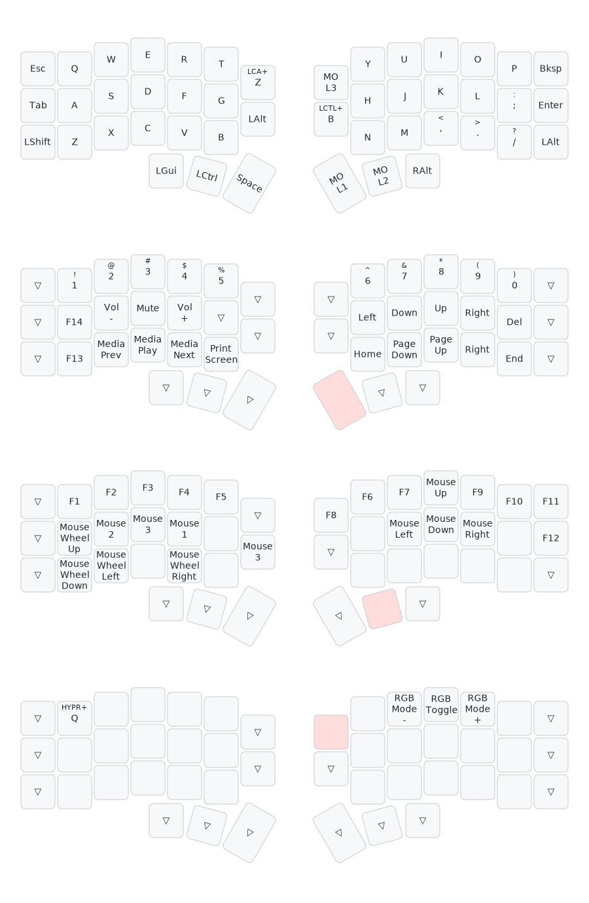

# ⌨️ crkbd

VIAL config for my Corne (foostan/crkbd) RGB keyboard.

My active layout emulates Ergo-L directly on the keyboard and can be found [here](./vil/keymap.vil).

## Specs

These are the specs for my keyboard:
- Keyboard: [Corne (foostan/crkbd)](https://github.com/foostan/crkbd) (v4.1)
- Total keys: 46 (2 x (3 × 6 + 3 + 2))
- Switches: [Kailh Choc v1 Brown](https://chosfox.com/products/kailh-chocs)
- Keycaps: [MBK Legend‡ Glow R2](https://fkcaps.com/keycaps/mbk/legend-glow-r2)
- Firmware: [VIAL](https://get.vial.today/) ([QMK](https://github.com/qmk/qmk_firmware) fork)
- Vendor: [Keebart](https://www.keebart.com/) ([keyboard reference](https://www.keebart.com/products/corne))
- RGB Lighting: yes
- QMK keyboard id: `crkbd/rev4_1/standard`
- QMK layout: `LAYOUT_split_3x6_3_ex2`

## Layout

First, it's important to distinguish between these two:
- **Firmware layout:** How the keys are mapped in the keyboard firmware itself (most commonly QWERTY)
- **Input method:** OS emulation layer that remaps some keys (ex: QWERTY, AZERTY, Dvorak, Colemack, etc.)

### Firmware Layout

> [!NOTE]
> - Converted [keymap.vil](./vil/keymap.vil) to [keymap-generated.yaml](./v2kmd/keymap-generated.yaml) with [vial-to-keymap-drawer](https://yal-tools.github.io/vial-to-keymap-drawer) (see: [v2kmd-settings.json](./v2kmd-settings.json))
> - Manually edited [keymap-generated.yaml](./v2kmd/keymap-generated.yaml) and saved to [keymap.yaml](./v2kmd/keymap.yaml)
> - Generated [keymap.svg](./images/keymap.svg) by loading [keymap.yaml](./v2kmd/keymap.yaml) into [keymap-drawer](https://keymap-drawer.streamlit.app)

### Notes on Ergo-L

[Ergo-L](https://ergol.org/) is an ergonomic OS layout/input method.
Similarly to [Dvorak](https://en.wikipedia.org/wiki/Dvorak_keyboard_layout) or [Colemack](https://en.wikipedia.org/wiki/Colemak), Ergo-L is an ergonomic keyboard layout.

Ergo-L is well thought out and optimized for typing in French, English, and offering an easy access to programming symbols.
The layout comes with four main "layers":
- Default layer for letters and other characters
- [Shift](https://en.wikipedia.org/wiki/Shift_key) modifier for uppercase letters and other alternate characters
- [Alt Graph (Right Alt)](https://en.wikipedia.org/wiki/AltGr_key) modifier for symbols (with easy to reach programming symbols)
- [Dead Key](https://en.wikipedia.org/wiki/Dead_key) for diacritical marks (accents)

Take a look at their website to learn more *(it's got some excellent advice when it comes to keyboard ergonomics!)*

**Website:** https://ergol.org/

### Input Method

I used to have Ergo-L as an input method, but I have now switched to emulating it directly on my keyboard firmware.
This means that I can just plug my keyboard into any computer with QWERTY and work right away without having to install Ergo-L as an input method on that machine.

I work with a lot of computers and I cannot install Ergo-L as an input method on all of them for various reasons.
Emulating Ergo-L directly on my keyboard allows me to have a keyboard that works everywhere without having to think about it.

> [!TIP]
> If you are not interested in emulating Ergo-L and would rather use it as an input method, have a look into the `keymap-old-not-emulated.*` files.

## Previous keyboard

The 46 keys corne was not my first ergo keyboard.

I started with a Sofle RGB: [coko7/sofle](https://github.com/coko7/sofle)
